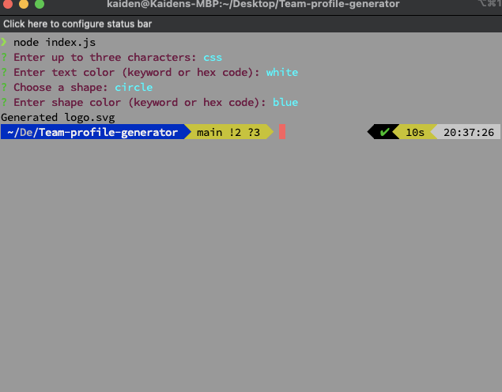
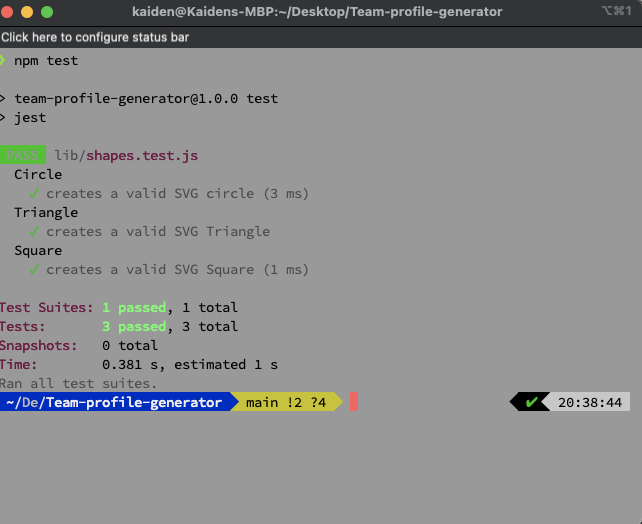

# Logo Generator

## Description 

This is a Node.js command-line application that prompts the user to input a short text string (up to three characters), text color, shape type, and shape color. Based on the user's input, the application creates a logo as an SVG file, using either a circle, triangle, or square shape with the specified color and the text string in the specified color at the center of the logo. The logo is saved as a file named "logo.svg" in the current directory, and a success message is printed to the console.

This project was a test of my ability! The testing process is very new to me and it took me a while to figure out, but with some help and refactoring, I was able to get them done. This project helped me sharpen my skills on testing and also constructors!

## Table of Contents (Optional)

If your README is very long, add a table of contents to make it easy for users to find what they need.

* [Installation](#installation)
* [Usage](#usage)
* [Credits](#credits)
* [License](#license)
* [Tests](#tests)

## Installation

To run this application, one needs to have a few items installed. First, the user must have access to a basic internet connection. Next, the user will need to install Node.js as this was the command line feature that was used to build this application. Check out the docs here https://docs.npmjs.com/downloading-and-installing-node-js-and-npm/

## Usage 

First, navigate to the directory in your command line.

Then run the command ‘Node index.js’. This will prompt the user with a set of questions, after finishing the questions, a logo.svg file will be uploaded into the directory.

## License

This application utilizes the MIT License. To learn more, visit: https://opensource.org/license/mit/

## Tests

To test this application, first navigate into the proper directory.
Then run ‘npm test’ and the testing will commence!

